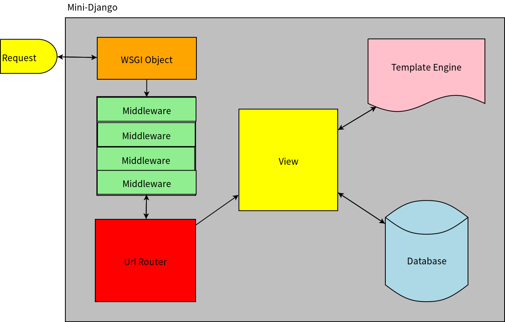

# mini-django
This project is a small django. It implements the basic features Django has, and it helps people who have little experience to the Django understand how django process a request from the browser. By knowing how Django works, you won't be terrified when you see so many features django provides and don't know how to use. Also, you can get most out of Django and customize your own project when you have a big picture about how django works in mind.

# Software architecture


# Project Architecture
```
mini-django
├── core		/* Core WSGI handler object */
├── database	/* Database handler object */
├── manage.py	/* convenient utilies code */
├── middleware	/* Some basic security middleware */
├── mini_http	/* Wrapper class for Http request and Http Response */
├── template	/* template engine */
├── urls		/* url router */
├── utils		/* convenient utilies code */
```

# How to use mini-django
1. Create your project setting file
```
python manage startproject [project_name]
```
2. Create your apps
```
python manage startapp [app_name]
```
3. Run server
```
python manage runserver [port]
```
