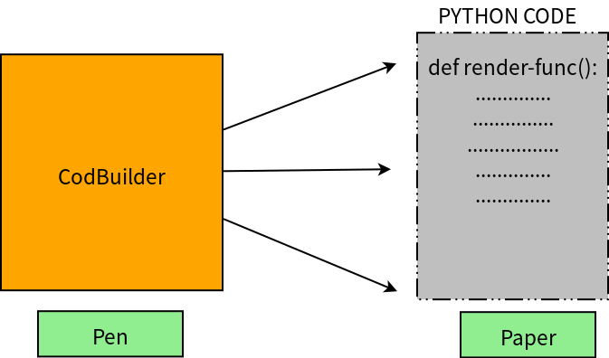
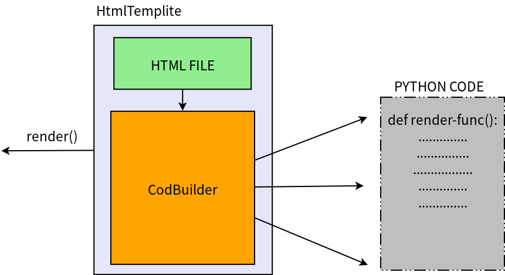

# Template Engine
Template engine's role is a **compiler**, which compiles source file(e.g *.html) to target file(python code)
Provide a interface to the user that user can pass the context data to it, and template engine will help user
render a html file.

# CodeBuilder
The only job Codebuilder needs to do is building the python source code.
Codebuilder's role is a **pen**, and the compiled code's role is **paper**.

# HtmlTemplite
HtmlTemplite is a template engine which only knows how to deal with html file.
it will compiile html file to a python source code, and provide user with a render interface.

