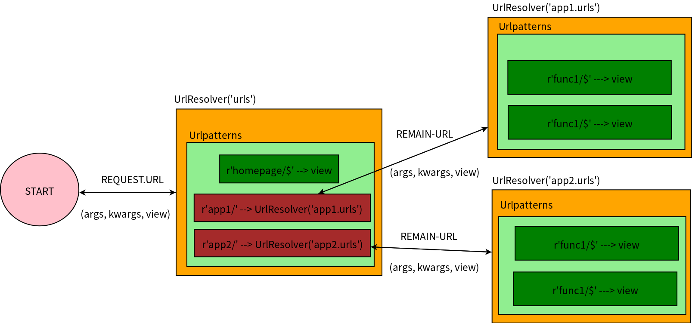

Url Router
===

# Model Architecture

* Process Work Flow
	1. Pass **url information** into the root urlresolver
	2. urlresolver look up the **urlpatterns list** to find the associated handler
	3. if the associated handler's type is function(view), then return the viewer
	4. if the associated hanlder's type is urlresolver, then passed the remaining url information to another urlresolver.
	5. Repeat 2 to 4 until urlresolver founds a handler of type function(view).
